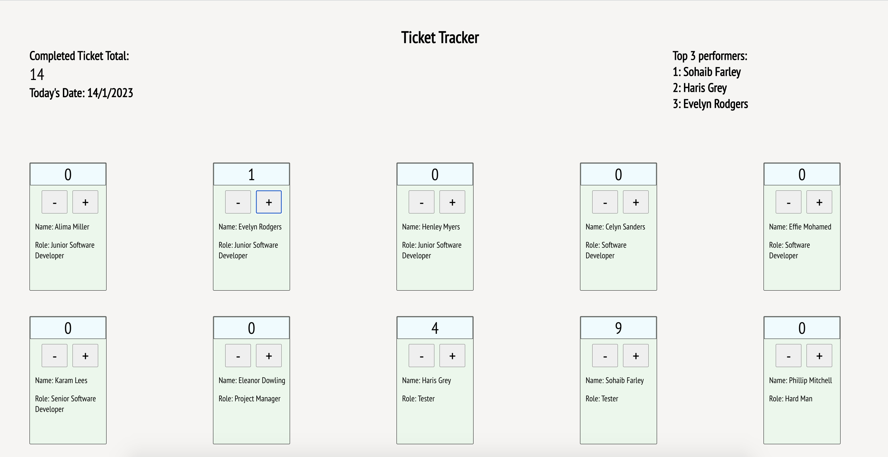

# Ticket Tracker

## Description

The ticket tracker is a project I undertook during my self-paced coding course within the react module. It is a simple design that allows up to 10 users to track the amount of tickets they are completing by clicking the plus or minus arrows. The top 3 performers are shown in a list on the right hand side and the total amount of completed tickets is shown on the left. 

I implemented recently acquired knowledge, keeping each part the page separate and passing data correctly by using props, state and components. I was also able to learn more about these through some of the functionality I implemented such as passing down functions as props and passing in complex data types as an argument in a useState hook. 

I initially attempted to create the top 3 by using an array of the employees' scores, whose index would correspond to the employee IDs. I faced the challenge of this becoming quite complicated and causing an issue where one of the names would not appear when scores were tied. I therefore then took a completely different approach, setting state to a 'team' array of employee objects which I could map over and create a new 'count' key within each object. This proved successful and simplified things a lot by having all the data in one place. 

## Usage Instructions
* To increase each individual score, click the '+' button on that tracker. 
* To decrease each individual score, click the '-' button on that tracker. 

## Operation and Display
* The total amount for each individual will be displayed on that individual's display above the operator keys. 
* The total amount for all of the combined scores will be totalled underneath 'Completed Ticket Total'
* The 'Top 3 Performers' section will calculate which individual is in 1st, 2nd or 3rd place in terms of the amount of tickets completed. 

## Future Additions

In future I may add a drop-down menu where users are able to select an employee and see the corresponding data for them. 

## How it looks
